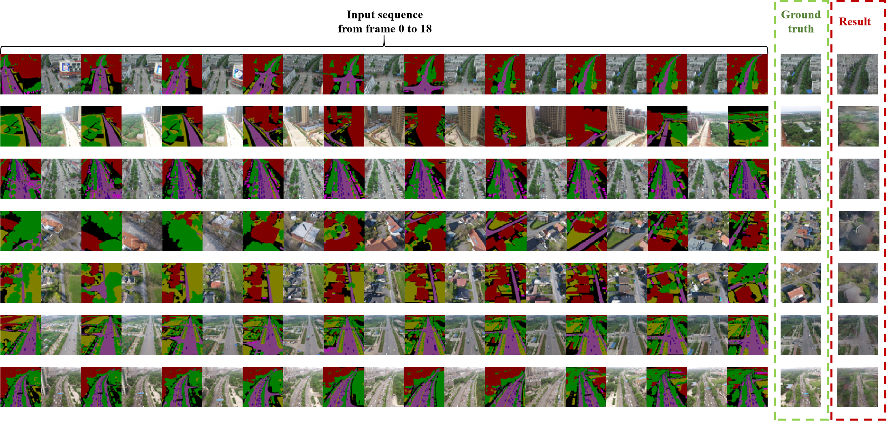
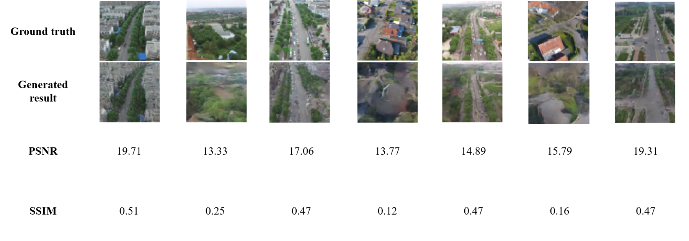
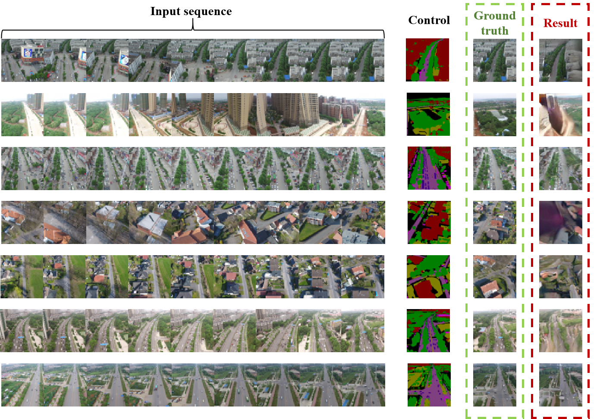
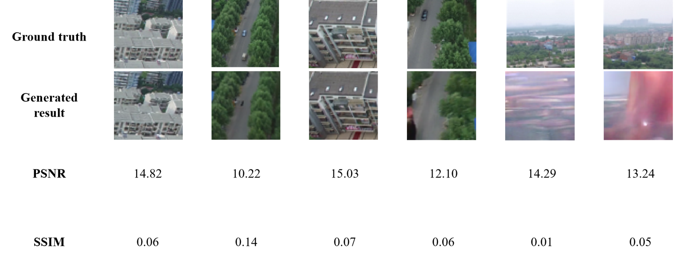

# ControlRaMViD-Video-Diffusion-for-Semantic-Scene-Reconstruciton
Dedicated to my MSc degree research. Make use of RaMViD, ControlNet and Semantic Segment Anything to realize semantic scene reconstruction for drones.
### Based on:
https://github.com/Tobi-r9/RaMViD  
https://github.com/fudan-zvg/Semantic-Segment-Anything  
https://github.com/lllyasviel/ControlNet  

## Idea

  

  

## Results

  

  

  

  

