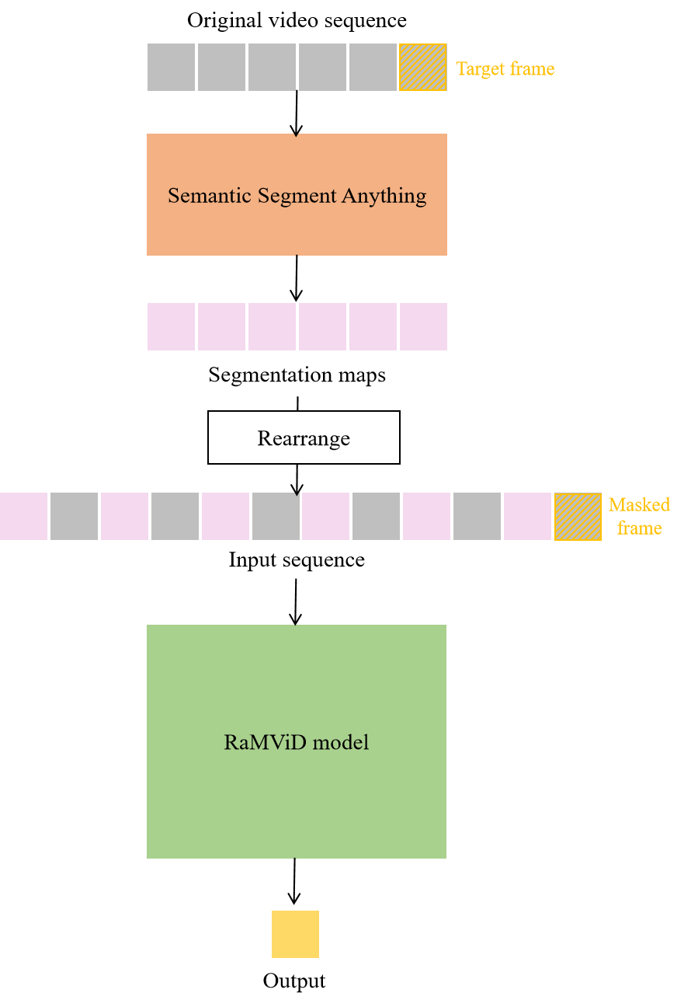

# ControlRaMViD-Video-Diffusion-for-Semantic-Scene-Reconstruciton
Dedicated to my MSc degree research. Make use of RaMViD, ControlNet and Semantic Segment Anything to realize semantic scene reconstruction for drones.
Based on:
https://github.com/Tobi-r9/RaMViD
https://github.com/fudan-zvg/Semantic-Segment-Anything
https://github.com/lllyasviel/ControlNet

## Idea

